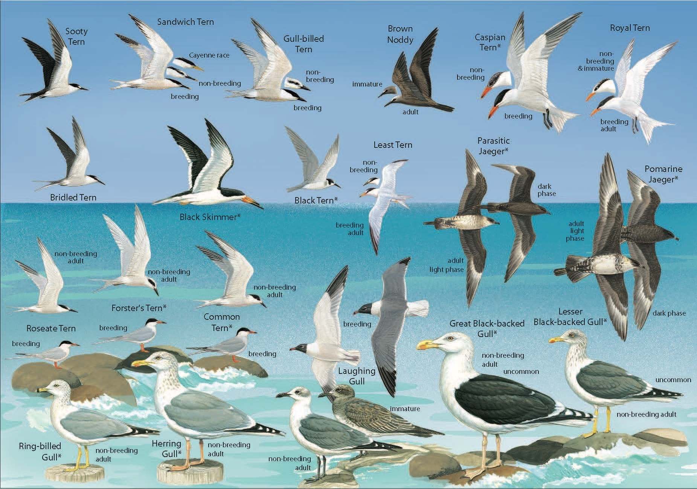

# Dirty Data Project Task 3 - Seabirds
> The following tasks are from the dirty data project at CodeClan as part of the
Professional Data Anlayst course (week 4). The work within the repository shows
the cleaning scripts, data and analysis.

## Information
> The repository cleans seabirds data (which contains 4 sheets) and combine
shipping and bird data into one file. This is the data is then analysed based 
upon the output from this.

 

## Installations
Ensure the following packages are installed prior to running:

+ tidyverse
+ janitor
+ assertr
+ readxl
+ rstudioapi

__Run the following if required to install__
```
install.packages(tidyverse)
install.packages(janitor)
install.packages(assertr)
install.packages(rstudioapi) # may be in tidyverse
install.packages(readxl) # may be in tidyverse

```

## Folder Structure

The folder structure is the following:

| Folder | Description |
| :------|:-----------:|
| **clean_data** | contains the cleaned |
| **data_cleaning_scripts** | Contains the script for cleaning the raw data |
| **analysis_and_documentation** | Contains files which analyse the cleaned data |
| **raw_data** | Contains the raw data |

## Cleaning file

Purpose of script:
 The script is used to merge and clean seabirds excel file (seabirds_raw.xls)
   * sheet - "Bird data by record ID"
   * Sheet - "Shipping data by record ID"

Output:
birds_clean.csv :
Cleaned data of .xls file.
* Load in the bird data codes to aid in loading columns correctly
* Load in shipping data and convert longitude / latitude columns
* Load in bird data
* Rename columns, select columns and remove missing bird data
* Join with shipping data using the record id
* Clean the species columns by removing age, plumage and sex characters
* If the record id and species data is the same, then combine since
age etc. has now been removed.

[Link to cleaned data](clean_data/birds_cleaned.csv)

[Link to cleaning script](data_cleaning_scripts/seabirds_clean_script.R)

[Link to raw data](raw_data/seabirds_raw.xls)

## Analysis

The .Rmd is used to analyse the birds_clean.csv file.
This raw data set is seabirds_raw.xls and is stored within the raw_data sub
folder.

[Link to cleaned data](clean_data/birds_cleaned.csv)

[Link to cleaning script](data_cleaning_scripts/seabirds_clean_script.R)

[Link to raw data](raw_data/seabirds_raw.xls)

> Questions which are being analysed are as follows:
1. Which bird had the most individual sightings?
2. Which bird had the highest total count?
3. Which bird had the highest total count above a latitude of -30?
4. How many different types of birds were only ever seen in groups of 1?
5. How many penguins were seen? (Hint: there are many types of penguin)